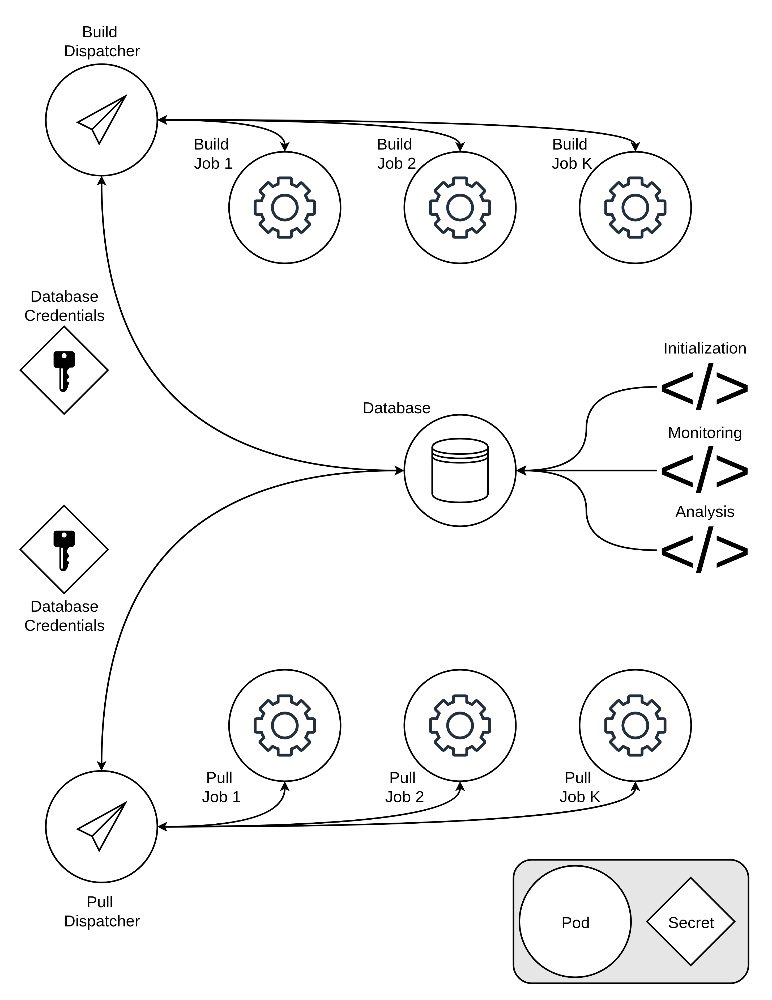

# socr8s

🗣️ "soh-KRAYTS" 

**socr8s**[^1] is a Kubernetes-native apparatus for reviewing containerized software at scale. The stack provides a means to store metadata about containerized software (e.g., repository, image specification file path), create a queue, and then systematically launch, monitor, and record results of jobs attempting to build or pull the image. Outcomes retained in the database include success/failure, image size, timing, and full logs.

## Architecture

The socr8s system has two components that share one database:

- **build**: Clones a Git repository, runs `docker build` against a specified Dockerfile and context, and records build success and image size.
- **pull**: Runs `docker pull` against a hosted image artifact and records whether the prebuilt image is retrievable, how large it is, and how long it takes to pull.

Each component is driven by a long-running **dispatcher**  that watches a MongoDB collection for queued work and iteratively launches a Kubernetes job for each item in the queue. Jobs themselves are ephemeral and communicate only with the dispatcher. Build and pull results are emitted in structured stdout, which the dispatchers translate to the database. Database credentials are managed by secrets configured when the stack is launched.

<p align="center">
  
</p>

## Requirements

socr8s is built for Kubernetes clusters. While the examples provided in this repo use Minikube, the stack can be instantiated on other Kubernetes implementations (e.g., K3s, kind, managed clusters) so long as the following conditions are met:

- **Privileged pods are permitted**: Both the build and pull jobs use Docker-in-Docker, which requires `privileged: true` in the job spec. Some clusters may restrict this configuration.
- **socr8s component images are visible in the cluster**: Specifications for four images required by the stack are provided in this repo. Currently, these images are not pushed to publicly hosted container registry. The dispatcher deployments and job pods use `image_pull_policy="Never"`, so images must be loaded and made available to the cluster (see [Launch step 3](#3-make-the-images-available-to-the-cluster)).

You will also need `kubectl` configured against the target cluster and a local Docker daemon to build the images.

## Launch

The stack runs in a single Kubernetes namespace (`build-system`) and consists of a MongoDB instance, the two dispatchers, and (once the queue is populated) the job pods.

Note that several identifiers are assumed and hardcoded throughout:

- Kubernetes namespace for all resources: `build-system`
- Kubernetes secret for MongoDB credentials: `mongo-creds`
- Docker image names for jobs: `socr8s-builder` and `socr8s-puller`
- Docker image names for dispatchers: `build-dispatcher` and `pull-dispatcher`
- MongoDB database name: `builddb`
- MongoDB collections: `builds` and `pulls`

To launch socr8s follow the steps below.

### 1. Create the namespace and database credentials

All resources are specified to use a namespace called `build-system`. The MongoDB credentials live in a Kubernetes secret named `mongo-creds` in this namespace. This secret is **not** committed to the repository and must be created in the namespace prior to any other launch steps.

First create the namespace:

```bash
kubectl create namespace build-system
```

And then the secret:

```bash
## creates mongo-creds as generic username and a random base64 encoded password
kubectl -n build-system create secret generic mongo-creds \
  --from-literal=MONGO_USERNAME=buildadmin \
  --from-literal=MONGO_PASSWORD="$(openssl rand -base64 24)"
```

Note that both the MongoDB deployment and the two dispatchers are configured to read this secret via `secretKeyRef`.

### 2. Deploy MongoDB

Launch the Mongo deployment:

```bash
kubectl apply -f mongo.yaml
```

Wait for the pod to become ready before continuing. The MongoDB is configured with a headless service, and the dispatchers depend on it resolving at `mongo.build-system.svc.cluster.local:27017`:

```bash
kubectl -n build-system rollout status deployment/mongo
```

### 3. Make the images available to the cluster

The cluster needs the two job images (`socr8s-builder`, `socr8s-puller`) and two dispatcher images (`build-dispatcher`,
`pull-dispatcher`). The Dockerfiles are provided for all four images.  Build them locally first:

```bash
docker build -t socr8s-builder:latest -f build/Dockerfile build
docker build -t build-dispatcher:latest build/build-dispatcher
docker build -t socr8s-puller:latest -f pull/Dockerfile  pull
docker build -t pull-dispatcher:latest pull/pull-dispatcher
```

How you get those images to the cluster depends on your platform. The manifests are designed with `imagePullPolicy: Never`, which means images must be loaded onto the node.

In Minikube, this can be accomplished with:

```bash
minikube image load socr8s-builder:latest
minikube image load build-dispatcher:latest
minikube image load socr8s-puller:latest
minikube image load pull-dispatcher:latest
```

Other platforms will require slightly different approaches. For example, K3S can import images into containerd with `k3s ctr import` and kind can load images with `kind load docker-image`.

### 4. Deploy the dispatchers

In addition to the deployment specs, each dispatcher manifest includes its own ServiceAccount, Role, and RoleBinding to grant access to create jobs and read pod logs. 

Deploying the dispatchers will create all required resources:

```bash
kubectl apply -f build/build-dispatcher.yaml
kubectl apply -f pull/pull-dispatcher.yaml
```

Confirm both are running:

```bash
kubectl -n build-system get deploy
kubectl -n build-system logs -f deploy/build-dispatcher
```

The dispatchers begin polling immediately and will process any queued items as soon as they appear in MongoDB. Each one dispatches up to `MAX_CONCURRENT` jobs at a time (defaults to 3 per the deployment manifests).

## Interacting with the stack

### Watching jobs

The dispatchers launch one Kubernetes job per queue item. You can watch them and read their logs directly with `kubectl`:

```bash
## live view of jobs as they run and complete
kubectl -n build-system get jobs -w

## logs for a specific job
kubectl -n build-system logs job/build-<id>

## or watch what the dispatcher itself is doing
kubectl -n build-system logs -f deploy/build-dispatcher
```

A completed job shows `1/1` under `COMPLETIONS`. However, the "outcome" (i.e., build/pull success or failure) is authoritatively stored in the `status` field in MongoDB once the job finishes.

### Connecting to the database

MongoDB is not exposed outside the cluster. For *ad hoc* access you can reach it via port-forward. The following command will need to be kept running in a dedicated terminal session:

```bash
kubectl -n build-system port-forward svc/mongo 27017:27017
```

To retrieve the password from the secret:

```bash
kubectl -n build-system get secret mongo-creds \
  -o jsonpath='{.data.MONGO_PASSWORD}' | base64 -d && echo
```

Depending on your plan for access (i.e., the MongoDB client and particulars of how that is scripted), you will need to store the credentials as a local secret or environment variable.

### Queuing and monitoring jobs

The queues for build and pull jobs are stored in MongoDB collections. Any MongoDB client can initialize or monitor details of items in the queue. A tool is queued for building or pulling by inserting a document with `status: "queued"` into the `builds` or `pulls` collection respectively. The dispatcher transmits updates to the status, logs, and outcome of the job that ultimately picks up the queued item. 

Keep in mind that the queuing, monitoring, and any other database interaction requires the port forward and secret detailed above.

For example, a minimal interaction to insert and monitor build results for a given tool might look like this:

```python
from datetime import datetime, timezone
from pymongo import MongoClient

## NOTE: the password would need to be provided either as a local secret or environment variable
client = MongoClient("mongodb://buildadmin:<password>@localhost:27017")
builds = client["builddb"]["builds"]

## queue a build
builds.insert_one({
    "repo_url":   "https://github.com/MBaysanLab/cosap",
    "image_tag":  "cosap:latest",
    "dockerfile": "Dockerfile",   # path relative to repo root
    "context":    ".",            # build context relative to repo root
    "status":     "queued",
    "created_at": datetime.now(timezone.utc),
})

## check results once the dispatcher has processed the queue
for doc in builds.find({"status": {"$in": ["succeeded", "failed", "timeout"]}}):
    print(doc["repo_url"], doc["status"], doc.get("image_size_bytes"))
```

Note that queuing a pull is analogous. The difference is that the required information for the pull is the `image_ref`: insert `{ 

```python
pulls = client["builddb"]["pulls"]

pulls.insert_one({
    "image_ref":  "biocontainers/samtools:1.9--h91753b0_8",
    "status":     "queued",
    "created_at": datetime.now(timezone.utc),
})
```

The [`examples/`](examples/) includes scripts that demonstrate additional ways to populate the
queue, including with shell helpers (see `enqueue-build.sh` and `enqueue-pull.sh`, both of which require `mongosh`). The directory also has a standalone Kubernetes build job spec (`build-job.yaml`) that could be run by hand and paired with a manual DB insert for demonstration purposes. 

## Considerations

The current implementation of socr8s has several known considerations, all of which are eligible for future improvements to the stack:

- **MongoDB does not have persistent storage**: The database uses an `emptyDir` volume, so data is lost if the pod is evicted. A PersistentVolumeClaim (or a managed MongoDB service) would make it durable.
- **Images need to be loaded directly**: The images used by the socr8s dispatchers and jobs are not currently available on public container registries. Manifests are specified to never attempt a pull. For more streamlined implementation, images should be built and pushed externally, with manifests accordingly updated to pull .
- **Build and pull jobs require privileged pods**: Docker-in-Docker needs `privileged: true`. Incorporating a rootless builder (e.g., Buildah) would allow smoother implementation on clusters that may prohibit this setting.
- **Database access is via port-forward**: Clients rely on `kubectl port-forward` for *ad hoc* access. A Kubernetes ingress or similar would be needed to allow persistent connection.


## License

socr8s is released under the MIT License. See [LICENSE](LICENSE) for more details.

[^1]: **so**ftware **c**ontainerization **r**eview ~~apparatu~~**8s**
